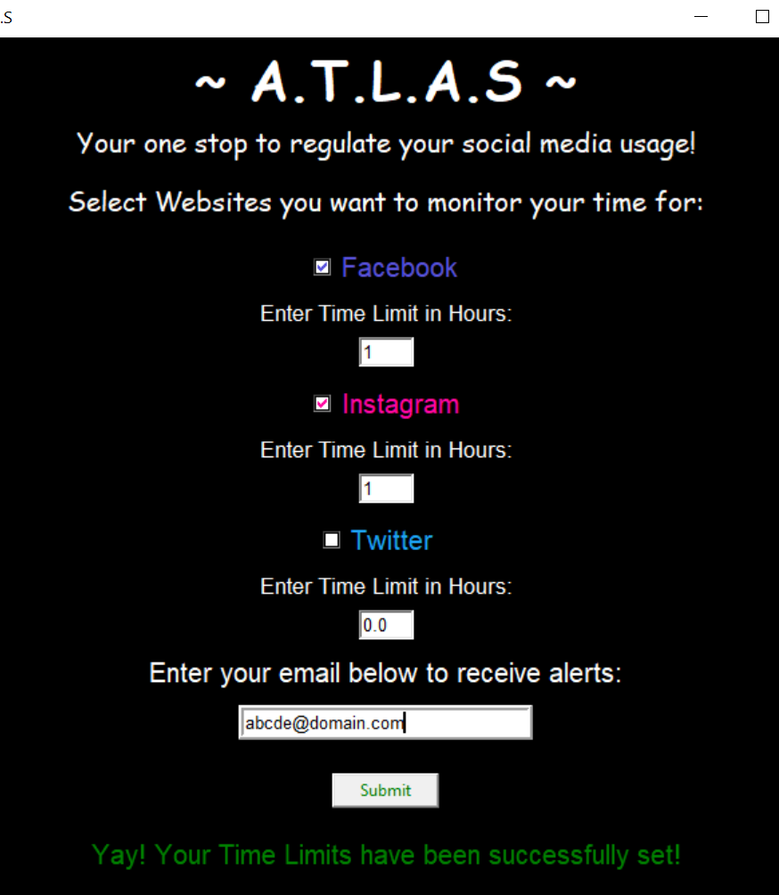

# A.T.L.A.S (Application Time Limit Alerting System)

Application Time Limit Alerting System is a desktop application to regulate your social media usage (Facebook, Instagram and Twitter)

  - Set the number of hours you spend on social media websites.
  - Get an alert once you exceed your daily time limit of usage.
  - Alerts sent via email, a desktop notification and a sound alert.
  
  #### Demo Image
  
   

### Requirements and usage
  - Setup a virtual environment. In your virtual environment, create a .env text file and set the 'email' and 'password' variables with your credentials.
  - Enable less security access in your Gmail id that you will be using to send email alerts.
  - Install all the dependencies mentioned in requirements.txt.
  -  Run the main.py file to start the application
  
